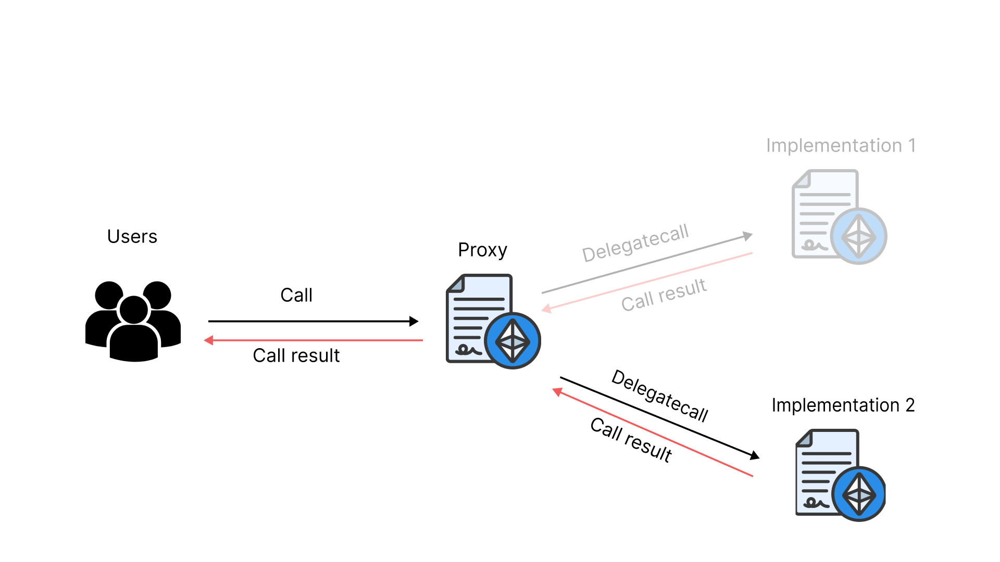

# UUPS Proxy Implementation

This repository contains an implementation of a UUPS (Universal Upgradeable Proxy Standard) proxy smart-contract.
All smart contracts are written with a detailed description, so you can view all the logic of the UUPS and understand every line.

This project was created more for explanation than for production!

## UUPS Proxy Smart Contract

The UUPS proxy smart-contract allows for a contract to be upgraded while preserving its state and balance. It achieves this by separating the contract's logic and storage into separate contracts:

-   proxy contract
-   implementation contract

The proxy contract acts as the public interface for the contract, while the implementation contract contains the contract's logic and state.

The proxy contract delegates calls to the implementation contract using the DELEGATECALL opcode. When the implementation contract is upgraded, the proxy contract remains unchanged, and all calls to the contract continue to go through the proxy contract. The implementation contract is stored separately from the proxy contract, so upgrading the implementation contract does not affect the storage of the contract, and the contract's balance is also preserved.

Before:


After:


---

## Tests

The repository includes a set of tests for the UUPS contract. The tests are written in Solidity using the Hardhat testing framework. The tests cover the following functionality:

The contract can be initialized with an initial implementation contract.
The contract's implementation can be upgraded using the upgradeTo function.
The contract's implementation can be upgraded to a new implementation and then upgraded again to a newer implementation.
The contract's implementation can be retrieved using the implementation function.

To run the tests, first clone the repository and install the required dependencies:

```shell
    git clone git@github.com:KumaCrypto/UUPS-Proxy-Implementation.git
    cd UUPS-Proxy-Implementation
    npm install -D
```

Then, run the tests:

```shell
    npx hardhat test
```

---

## Usage

In order to use the UUPS functionality, you need to inherit from `UUPSUpgradeable` and rewrite the `_authorizeUpgrade` function with the authorization functionality you need.

The proxy logic itself is located in the `Proxy` folder.

Also in the repository there is an assistant in proxy management: `ProxyManager`, it takes over the functionality of primary deployment, updating and forming calldata for `initialize`.

To upgrade the implementation contract, call the `upgradeTo` function on the proxy contract, passing in the address of the new implementation contract.

---

## Disclaimer

The UUPS smart contract provided herein has not been audited by any third-party security firm or organization. Therefore, it may contain vulnerabilities, errors, or bugs that could potentially cause financial loss or other damages to the user. Use of this smart contract is at the user's own risk, and the developers or creators of this smart contract will not be held responsible for any such losses or damages. It is strongly recommended that users thoroughly review the code and perform their own due diligence before interacting with the contract.

---

# License

This repository is licensed under the MIT License. See the LICENSE file for more information.

---

### Special thanks

Thanks to ChatGPT for part of this README 😊
